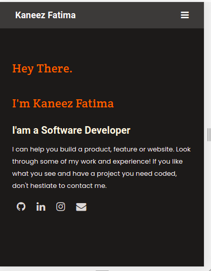

# portfolio-website
### Portfolio Website

> This project is a exercise on HTML and CSS for the practice of Semantic HTML, flexbox, background properties, and mobile-first responsiveness

## Built With

- Semantic HTML & CSS
- Github workflow
- Linters Set Up

## Live Preview 

[Live Demo Link](https://kaneez98fatima.github.io/portfolio_website/)

## Author

👤 **Kaneez Fatima**

- GitHub: [@Kaneez98fatima](https://github.com/Kaneez98Fatima))

- LinkedIn: [@Kaneez98fatima](https://www.linkedin.com/in/kaneez-fatima-0a86601b3)

## 🤝 Contributing

Contributions, issues, and feature requests are welcome!

Feel free to check the [issues page](../../issues/).

## Show your support

Give a ⭐️ if you like this project!

## Acknowledgments

- Microverse
- [Figma](https://www.figma.com/file/l7SqJ3ZfkAKih9sFxvWSR4/Microverse-Student-Project-1?node-id=1%3A1471)
- Code reviewer(s).

## 📝 License

[MIT licensed]

